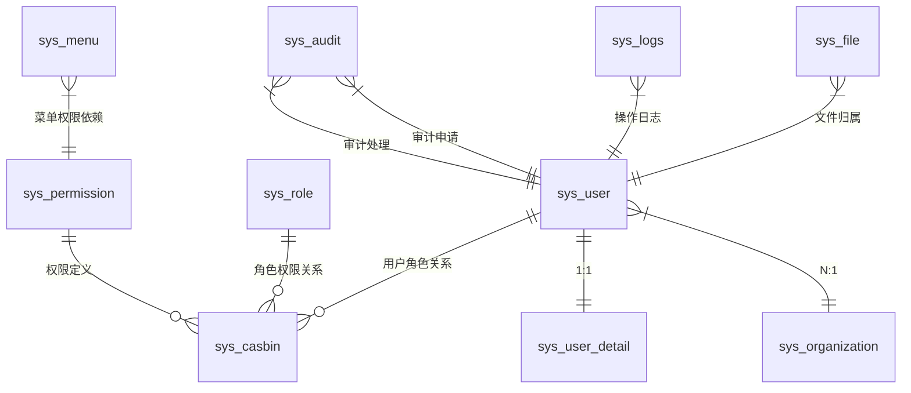

# GF-Admin-Community 项目技术文档

## 📋 目录
1. [项目概述](#项目概述)
2. [技术架构](#技术架构)
3. [数据库设计](#数据库设计)
4. [API接口设计](#api接口设计)
5. [业务模块设计](#业务模块设计)
6. [部署运维](#部署运维)
7. [开发指南](#开发指南)
8. [安全设计](#安全设计)

---

## 🎯 项目概述

### 项目简介
GF-Admin-Community 是基于 GoFrame v2 框架开发的企业级管理系统基础框架，采用组件化设计，提供完整的用户管理、权限控制、组织架构等核心功能模块。项目遵循现代化的微服务架构设计原则，支持多租户、多语言、高并发场景。

### 核心特性
- ✅ **权限管理**：基于 JWT + Casbin 的 RBAC 权限系统
- ✅ **用户管理**：完整的用户注册、认证、状态管理
- ✅ **角色管理**：灵活的角色定义和权限分配
- ✅ **组织架构**：支持多级组织结构管理
- ✅ **文件管理**：支持多云存储和 OCR 识别
- ✅ **配置管理**：动态配置和前端设置管理
- ✅ **审计系统**：完整的操作日志和审计追踪
- ✅ **多租户支持**：企业级多租户数据隔离
- ✅ **国际化**：支持多语言界面
- 🚧 **短信网关**：支持多云厂商短信服务
- 🚧 **存储网关**：统一的对象存储接口

### 技术栈

#### 后端技术栈
- **开发语言**: Go 1.24+
- **核心框架**: GoFrame v2.9.0
- **数据库**: PostgreSQL 14.5+
- **缓存**: Redis
- **权限框架**: Casbin v2.104.0
- **认证方案**: JWT (golang-jwt/jwt/v4)
- **ID生成器**: Snowflake (yitter/idgenerator-go)

#### 第三方服务集成
- **云服务商**: 阿里云、腾讯云、华为云、天翼云、百度云
- **OCR服务**: 身份证、营业执照、银行卡识别
- **短信服务**: 多云厂商短信发送
- **对象存储**: 多云存储统一接口
- **验证码服务**: base64Captcha

---

## 🏗️ 技术架构

### 整体架构
```
┌─────────────────────────────────────────────────────────┐
│                    前端应用层                           │
├─────────────────────────────────────────────────────────┤
│                   API网关层 (v1)                        │
├─────────────────────────────────────────────────────────┤
│                    控制器层                             │
│  ├─ sys_controller (接口处理)                          │
│  ├─ 参数验证 & 数据绑定                               │
│  └─ 权限检查 & 结果返回                               │
├─────────────────────────────────────────────────────────┤
│                    业务逻辑层                           │
│  ├─ sys_service (接口定义)                             │
│  ├─ internal/logic (业务实现)                          │
│  └─ Hook系统 (扩展点)                                  │
├─────────────────────────────────────────────────────────┤
│                    数据访问层                           │
│  ├─ sys_model (数据模型)                               │
│  ├─ sys_dao (数据访问)                                 │
│  └─ sys_entity (实体定义)                              │
├─────────────────────────────────────────────────────────┤
│                   基础设施层                            │
│  ├─ 数据库 (PostgreSQL)                               │
│  ├─ 缓存 (Redis)                                       │
│  ├─ 文件存储 (多云支持)                               │
│  └─ 第三方服务 (SDK集成)                              │
└─────────────────────────────────────────────────────────┘
```

### 目录结构详解
```
/
├── api_v1/                    # API接口定义层
│   └── sys_api/              # 系统API定义(请求/响应结构)
├── database/                 # 数据库相关
│   └── migrations.sql        # 数据库迁移脚本
├── internal/                 # 内部实现(不对外暴露)
│   ├── boot/                 # 系统启动引导
│   ├── cmd/                  # 命令行工具
│   └── logic/                # 业务逻辑实现
│       ├── sdk_*/            # 第三方SDK集成
│       ├── sys_auth/         # 认证授权逻辑
│       ├── sys_user/         # 用户管理逻辑
│       └── ...               # 其他业务模块
├── sys_controller/           # 控制器层(HTTP处理)
├── sys_model/                # 数据模型层
│   ├── sys_dao/              # 数据访问对象
│   ├── sys_do/               # 领域对象(工具生成)
│   ├── sys_entity/           # 数据实体(工具生成)
│   └── sys_enum/             # 枚举定义
├── sys_service/              # 服务接口定义层
├── utility/                  # 工具库
│   ├── en_crypto/            # 加密工具
│   ├── funs/                 # 通用函数
│   └── enum/                 # 枚举工具
├── docs/                     # 项目文档
├── example/                  # 示例代码
├── hack/                     # 开发工具
├── manifest/                 # 部署配置
└── resources/                # 静态资源
```

### 设计模式

#### 1. 依赖注入模式
```go
// 服务注册
func RegisterSysUser(i ISysUser) {
    localSysUser = i
}

// 服务获取
func SysUser() ISysUser {
    if localSysUser == nil {
        g.Log().Error(context.Background(), "ISysUser服务未注册")
        return nil
    }
    return localSysUser
}
```

#### 2. Hook扩展模式
```go
// 定义Hook接口
type UserHookFunc func(ctx context.Context, in sys_hook.UserHookInfo) sys_hook.UserHookInfo

// 安装Hook
func (s *sSysUser) InstallHook(event sys_enum.UserEvent, hookFunc sys_hook.UserHookFunc) int64
```

#### 3. 权限装饰器模式
```go
// 权限检查装饰器
func CheckPermission[TRes any](ctx context.Context, 
    f func() (TRes, error), 
    permissions ...base_permission.IPermission) (TRes, error)
```

---

## 🗄️ 数据库设计

### 核心表结构

#### 用户管理表

**sys_user** - 用户基础信息
```sql
CREATE TABLE sys_user (
    id            BIGINT PRIMARY KEY,
    username      VARCHAR(64) UNIQUE NOT NULL,
    password      VARCHAR(255) NOT NULL,
    salt          VARCHAR(255),        -- 密码盐值
    mobile        VARCHAR(32),
    email         VARCHAR(128),
    state         INT DEFAULT 1,       -- 用户状态: 0=未激活,1=正常,-1=封禁
    type          BIGINT DEFAULT 1,    -- 用户类型位掩码
    union_main_id BIGINT DEFAULT 0,    -- 租户ID
    created_at    TIMESTAMP DEFAULT CURRENT_TIMESTAMP,
    updated_at    TIMESTAMP DEFAULT CURRENT_TIMESTAMP ON UPDATE CURRENT_TIMESTAMP,
    deleted_at    TIMESTAMP NULL,
    created_by    BIGINT DEFAULT 0,
    updated_by    BIGINT DEFAULT 0,
    deleted_by    BIGINT DEFAULT 0
);
```

**用户类型枚举**:
- `0`: 匿名用户
- `1`: 普通用户  
- `2`: 微商户
- `4`: 商户
- `8`: 广告主
- `16`: 服务商
- `32`: 运营中心
- `64`: 后台用户

**sys_user_detail** - 用户详细信息
```sql
CREATE TABLE sys_user_detail (
    id                BIGINT PRIMARY KEY,  -- 对应sys_user.id
    realname          VARCHAR(64),
    union_main_name   VARCHAR(255),
    last_login_ip     VARCHAR(45),
    last_login_area   VARCHAR(255),
    last_login_at     TIMESTAMP,
    last_heartbeat_at TIMESTAMP,
    is_online         BOOLEAN DEFAULT FALSE,
    -- 更多扩展字段...
);
```

#### 权限管理表

**sys_role** - 角色定义
```sql
CREATE TABLE sys_role (
    id            BIGINT PRIMARY KEY,
    name          VARCHAR(64) NOT NULL,
    description   TEXT,
    is_system     BOOLEAN DEFAULT FALSE,  -- 系统角色不可删除
    union_main_id BIGINT DEFAULT 0,
    -- 标准审计字段...
);
```

**sys_permission** - 权限定义
```sql
CREATE TABLE sys_permission (
    id             BIGINT PRIMARY KEY,
    parent_id      BIGINT DEFAULT 0,       -- 父权限ID
    name           VARCHAR(64) NOT NULL,
    identifier     VARCHAR(128) UNIQUE,    -- 权限标识符
    type           INT DEFAULT 1,          -- 1=API权限,2=菜单权限
    match_mode     INT DEFAULT 0,          -- 匹配模式:0=ID匹配,1=标识符匹配
    is_show        BOOLEAN DEFAULT TRUE,
    sort           INT DEFAULT 0,
    -- 标准审计字段...
);
```

**sys_casbin** - Casbin策略存储
```sql
CREATE TABLE sys_casbin (
    id    BIGINT PRIMARY KEY,
    ptype VARCHAR(100),  -- 策略类型
    v0    VARCHAR(100),  -- 主体
    v1    VARCHAR(100),  -- 对象  
    v2    VARCHAR(100),  -- 动作
    v3    VARCHAR(100),
    v4    VARCHAR(100),
    v5    VARCHAR(100)
);
```

#### 组织架构表

**sys_organization** - 组织结构
```sql
CREATE TABLE sys_organization (
    id           BIGINT PRIMARY KEY,
    parent_id    BIGINT DEFAULT 0,
    name         VARCHAR(128) NOT NULL,
    cascade_deep INT DEFAULT 1,        -- 级联深度
    -- 标准审计字段...
);
```

#### 菜单导航表

**sys_menu** - 菜单定义
```sql
CREATE TABLE sys_menu (
    id                      BIGINT PRIMARY KEY,
    parent_id               BIGINT DEFAULT 0,
    path                    VARCHAR(255),       -- 路由路径
    name                    VARCHAR(128),       -- 路由名称  
    title                   VARCHAR(128),       -- 菜单标题
    icon                    VARCHAR(128),       -- 菜单图标
    component               VARCHAR(255),       -- 组件路径
    layout                  VARCHAR(64),        -- 布局组件
    i18n_key               VARCHAR(128),       -- 国际化key
    dep_permission_ids      TEXT,              -- 依赖权限ID列表
    limit_hidden_role_ids   TEXT,              -- 角色可见性控制
    limit_hidden_user_ids   TEXT,              -- 用户可见性控制
    limit_hidden_user_types BIGINT,            -- 用户类型可见性
    type                    INT DEFAULT 1,      -- 1=菜单,2=按钮
    redirect                VARCHAR(255),       -- 重定向地址
    redirect_type           INT DEFAULT 1,      -- 1=当前页,2=新标签
    sort                    INT DEFAULT 0,
    -- 标准审计字段...
);
```

#### 文件管理表

**sys_file** - 文件信息
```sql
CREATE TABLE sys_file (
    id               BIGINT PRIMARY KEY,
    name             VARCHAR(255) NOT NULL,      -- 文件名
    src              VARCHAR(1024),              -- 原始路径
    url              VARCHAR(1024),              -- 访问URL
    ext              VARCHAR(32),                -- 文件扩展名
    size             BIGINT DEFAULT 0,           -- 文件大小(字节)
    category         VARCHAR(64),               -- 文件分类
    user_id          BIGINT,                    -- 上传用户ID
    union_main_id    BIGINT DEFAULT 0,          -- 租户ID
    local_path       VARCHAR(1024),             -- 本地存储路径
    allow_anonymous  BOOLEAN DEFAULT FALSE,     -- 允许匿名访问
    -- 标准审计字段...
);
```

#### 系统配置表

**sys_config** - 系统配置
```sql
CREATE TABLE sys_config (
    id    BIGINT PRIMARY KEY,
    name  VARCHAR(128) UNIQUE NOT NULL,  -- 配置名称
    value TEXT,                          -- 配置值(JSON格式)
    -- 标准审计字段...
);
```

#### 审计日志表

**sys_logs** - 系统日志
```sql
CREATE TABLE sys_logs (
    id       BIGINT PRIMARY KEY,
    user_id  BIGINT,
    category VARCHAR(64),       -- 日志分类
    level    VARCHAR(16),       -- 日志级别  
    content  TEXT,             -- 日志内容
    context  TEXT,             -- 上下文信息(JSON)
    error    TEXT,             -- 错误信息
    -- 标准审计字段...
);
```

**sys_audit** - 业务审计
```sql
CREATE TABLE sys_audit (
    id             BIGINT PRIMARY KEY,
    union_main_id  BIGINT DEFAULT 0,
    user_id        BIGINT,               -- 申请用户
    audit_user_id  BIGINT,               -- 审核用户
    category       BIGINT DEFAULT 1,     -- 审计类别
    state          INT DEFAULT 0,        -- 审核状态:0=待审,1=通过,2=拒绝
    reply          VARCHAR(1024),        -- 审核回复
    audit_data     TEXT,                -- 审核数据(JSON)
    audit_group    VARCHAR(64),         -- 审核分组
    expire_at      TIMESTAMP,           -- 过期时间
    audit_reply_at TIMESTAMP,           -- 审核回复时间
    -- 标准审计字段...
);
```

### 数据库关系图



### 索引设计

**核心索引**:
```sql
-- 用户相关索引
CREATE INDEX idx_sys_user_username ON sys_user(username);
CREATE INDEX idx_sys_user_mobile ON sys_user(mobile);  
CREATE INDEX idx_sys_user_email ON sys_user(email);
CREATE INDEX idx_sys_user_union_main_id ON sys_user(union_main_id);
CREATE INDEX idx_sys_user_state_type ON sys_user(state, type);

-- 权限相关索引
CREATE INDEX idx_sys_casbin_ptype ON sys_casbin(ptype);
CREATE INDEX idx_sys_casbin_v0_v1_v2 ON sys_casbin(v0, v1, v2);

-- 菜单权限索引
CREATE INDEX idx_sys_menu_parent_id ON sys_menu(parent_id);
CREATE INDEX idx_sys_menu_type_sort ON sys_menu(type, sort);

-- 审计日志索引
CREATE INDEX idx_sys_logs_user_id ON sys_logs(user_id);
CREATE INDEX idx_sys_logs_category_created_at ON sys_logs(category, created_at);
CREATE INDEX idx_sys_audit_state ON sys_audit(state);
CREATE INDEX idx_sys_audit_user_id ON sys_audit(user_id);
```

---

## 🌐 API接口设计

### REST API 设计原则

#### 1. URI 设计规范
- **版本化**: `/api/v1/` 前缀
- **资源导向**: 使用名词而非动词
- **层级关系**: 体现资源的层级结构
- **参数传递**: 查询参数用于过滤和分页

#### 2. HTTP 方法规范
```
GET    /api/v1/user/{id}        # 获取单个用户
GET    /api/v1/user/list        # 获取用户列表
POST   /api/v1/user             # 创建用户
PUT    /api/v1/user/{id}        # 更新用户
DELETE /api/v1/user/{id}        # 删除用户
```

#### 3. 状态码规范
- `200`: 成功
- `201`: 创建成功
- `400`: 客户端错误
- `401`: 未认证
- `403`: 权限不足
- `404`: 资源不存在
- `500`: 服务器错误

### 核心API模块

#### 认证授权 API

**用户登录**
```http
POST /api/v1/auth/login
Content-Type: application/json

{
    "username": "admin",
    "password": "123456",
    "captcha": "abc123"
}

Response:
{
    "code": 0,
    "message": "success",
    "data": {
        "tokenInfo": {
            "token": "eyJhbGciOiJIUzI1NiIsInR5cCI6IkpXVCJ9...",
            "refreshToken": "eyJhbGciOiJIUzI1NiIsInR5cCI6IkpXVCJ9...",
            "expireAt": "2024-01-01T12:00:00Z"
        },
        "user": {
            "id": 1,
            "username": "admin",
            "mobile": "138****8888",
            "state": 1,
            "type": 64
        }
    }
}
```

**用户注册**
```http
POST /api/v1/auth/register  
Content-Type: application/json

{
    "username": "newuser",
    "password": "123456",
    "confirmPassword": "123456", 
    "mobile": "13888888888",
    "captcha": "abc123"
}
```

**刷新Token**
```http
POST /api/v1/auth/refreshToken
Authorization: Bearer {refreshToken}
```

#### 用户管理 API

**获取用户列表**
```http
GET /api/v1/user/list?page=1&limit=10&keywords=admin
Authorization: Bearer {token}

Response:
{
    "code": 0,
    "data": {
        "records": [
            {
                "id": 1,
                "username": "admin",
                "mobile": "138****8888",
                "state": 1,
                "createdAt": "2024-01-01T10:00:00Z"
            }
        ],
        "total": 100,
        "page": 1,
        "limit": 10
    }
}
```

**创建用户**
```http
POST /api/v1/user
Authorization: Bearer {token}
Content-Type: application/json

{
    "username": "testuser",
    "password": "123456", 
    "mobile": "13999999999",
    "email": "test@example.com",
    "type": 1
}
```

**更新用户信息**
```http
PUT /api/v1/user/{id}
Authorization: Bearer {token}
Content-Type: application/json

{
    "mobile": "13888888888",
    "email": "newemail@example.com",
    "state": 1
}
```

**设置用户角色**
```http
POST /api/v1/user/setRoles
Authorization: Bearer {token}
Content-Type: application/json

{
    "id": 1,
    "roleIds": [1, 2, 3]
}
```

**设置用户权限**
```http
POST /api/v1/user/setPermissions
Authorization: Bearer {token}
Content-Type: application/json

{
    "id": 1,
    "permissionIds": [1, 2, 3, 4]
}
```

#### 角色管理 API

**获取角色列表**
```http
GET /api/v1/role/list?unionMainId=0
Authorization: Bearer {token}
```

**创建角色**
```http
POST /api/v1/role
Authorization: Bearer {token}
Content-Type: application/json

{
    "name": "管理员", 
    "description": "系统管理员角色",
    "unionMainId": 0
}
```

**分配角色权限**
```http
POST /api/v1/role/setPermissions
Authorization: Bearer {token}
Content-Type: application/json

{
    "id": 1,
    "permissionIds": [1, 2, 3, 4, 5]
}
```

#### 权限管理 API

**获取权限树**
```http
GET /api/v1/permission/tree
Authorization: Bearer {token}

Response:
{
    "code": 0,
    "data": [
        {
            "id": 1,
            "name": "用户管理",
            "identifier": "user",
            "type": 2,
            "children": [
                {
                    "id": 2,
                    "name": "查看用户",
                    "identifier": "user.view",
                    "type": 1
                }
            ]
        }
    ]
}
```

**创建权限**
```http
POST /api/v1/permission
Authorization: Bearer {token}
Content-Type: application/json

{
    "parentId": 1,
    "name": "删除用户",
    "identifier": "user.delete", 
    "type": 1,
    "sort": 100
}
```

#### 文件管理 API

**上传文件**
```http
POST /api/v1/common/file/upload
Authorization: Bearer {token}
Content-Type: multipart/form-data

file: [binary]
category: "avatar"
```

**获取文件信息**
```http
GET /api/v1/common/file/{id}
Authorization: Bearer {token}
```

**OCR识别**
```http
POST /api/v1/common/file/ocr
Authorization: Bearer {token}
Content-Type: multipart/form-data

file: [binary]
ocrType: "idCard"  // idCard, businessLicense, bankCard
```

### 请求响应格式

#### 统一响应格式
```go
// 成功响应
{
    "code": 0,
    "message": "success", 
    "data": {...}
}

// 错误响应
{
    "code": 40001,
    "message": "用户名已存在",
    "data": null
}
```

#### 分页响应格式
```go
{
    "code": 0,
    "data": {
        "records": [...],    // 数据记录
        "total": 100,       // 总记录数
        "page": 1,          // 当前页
        "limit": 10,        // 每页大小
        "pages": 10         // 总页数
    }
}
```

#### 请求参数验证
```go
type LoginReq struct {
    g.Meta   `path:"/login" method:"post" summary:"用户登录" tags:"认证"`
    Username string `json:"username" v:"required#请输入用户名" dc:"用户名"`
    Password string `json:"password" v:"required|length:6,32#请输入密码|密码长度6-32位" dc:"密码"`
    Captcha  string `json:"captcha" v:"required#请输入验证码" dc:"验证码"`
}
```

### API 安全机制

#### 1. JWT Token 认证
- **Access Token**: 短期有效token(2小时)
- **Refresh Token**: 长期有效token(7天)
- **Token轮换**: Refresh时生成新的token对

#### 2. 权限检查中间件
```go
func CheckPermission(ctx context.Context, permissions ...IPermission) error {
    user := sys_service.BizCtx().GetUser(ctx)
    if user == nil {
        return gerror.NewCode(gcode.CodeNotAuthorized, "未登录")
    }
    
    // Casbin权限检查
    for _, permission := range permissions {
        if !sys_service.Casbin().Enforce(user, permission) {
            return gerror.NewCode(gcode.CodeNotAuthorized, "权限不足")
        }
    }
    return nil
}
```

#### 3. 请求频率限制
- 登录接口: 5次/分钟
- 注册接口: 1次/分钟  
- 一般接口: 100次/分钟
- 文件上传: 10次/分钟

#### 4. 数据脱敏
```go
// 敏感数据自动脱敏
func (s *sSysUser) masker(user *sys_model.SysUser) *sys_model.SysUser {
    user.Password = masker.MaskString(user.Password, masker.Password)
    user.Mobile = masker.MaskString(user.Mobile, masker.MaskPhone) 
    user.Email = masker.MaskString(user.Email, masker.MaskEmail)
    return user
}
```

---

## 🔧 业务模块设计

### 用户管理模块

#### 核心功能
- **用户注册**: 支持用户名、手机号、邮箱注册
- **用户认证**: 多种登录方式(用户名/手机/邮箱 + 密码)
- **密码管理**: 密码加密、重置、修改
- **用户状态**: 激活、正常、封禁、注销等状态管理
- **用户类型**: 支持多种用户类型的区分管理

#### 密码安全机制
```go
// 密码加密 - 支持bcrypt和scrypt迁移
func PwdHash(password, salt string) (string, error) {
    if strings.HasPrefix(password, "$2") {
        // 已经是bcrypt格式
        return password, nil
    }
    
    // 使用bcrypt加密
    hash, err := bcrypt.GenerateFromPassword([]byte(password), bcrypt.DefaultCost)
    if err != nil {
        return "", err
    }
    return string(hash), nil
}

// 密码验证 - 支持旧版本兼容
func MigrateLegacyHash(password, storedHash, salt string) (newHash string, needUpdate bool, err error) {
    // 尝试bcrypt验证
    if strings.HasPrefix(storedHash, "$2") {
        err = bcrypt.CompareHashAndPassword([]byte(storedHash), []byte(password))
        return storedHash, false, err
    }
    
    // 旧版scrypt验证
    oldHash := ScryptHash(password, salt)
    if storedHash == oldHash {
        // 验证成功，升级到bcrypt
        newHash, err = PwdHash(password, salt)
        return newHash, true, err
    }
    
    return "", false, errors.New("密码验证失败")
}
```

#### 用户状态管理
```go
// 用户状态枚举
var State = state{
    Unactivated: enum.New[StateEnum](0, "未激活"),
    Normal:      enum.New[StateEnum](1, "正常"),
    Suspended:   enum.New[StateEnum](-1, "封禁"),
    Abnormality: enum.New[StateEnum](-2, "异常"),
    Canceled:    enum.New[StateEnum](-3, "注销"),
}

// 用户类型枚举(位掩码)
var Type = userType{
    Anonymous:   enum.New[TypeEnum](0, "匿名用户"),
    User:        enum.New[TypeEnum](1, "普通用户"),
    WeBusiness:  enum.New[TypeEnum](2, "微商户"),
    Merchant:    enum.New[TypeEnum](4, "商户"),
    Advertiser:  enum.New[TypeEnum](8, "广告主"),
    Facilitator: enum.New[TypeEnum](16, "服务商"),
    Operator:    enum.New[TypeEnum](32, "运营中心"),
    Admin:       enum.New[TypeEnum](64, "后台用户"),
    SuperAdmin:  enum.New[TypeEnum](-1, "超级管理员"),
}
```

### 权限管理模块

#### RBAC权限模型
基于Casbin实现的灵活RBAC权限系统:

```
用户(Subject) -> 角色(Role) -> 权限(Permission) -> 资源(Object)
```

#### 权限类型
- **API权限**: 控制接口访问权限
- **菜单权限**: 控制页面访问权限
- **数据权限**: 控制数据访问范围(计划中)

#### Casbin策略示例
```
# 角色权限策略
p, role_admin, /api/v1/user/*, *
p, role_user, /api/v1/user/info, GET

# 用户角色映射
g, user_1, role_admin
g, user_2, role_user

# 继承关系
g2, role_admin, role_user
```

#### 权限检查机制
```go
// 权限检查装饰器
func CheckPermission[TRes any](ctx context.Context, 
    f func() (TRes, error), 
    permissions ...base_permission.IPermission) (TRes, error) {
    
    var zeroRes TRes
    user := sys_service.BizCtx().GetUser(ctx)
    if user == nil {
        return zeroRes, gerror.NewCode(gcode.CodeNotAuthorized, "未登录")
    }
    
    // 超级管理员跳过权限检查
    if user.Type&sys_enum.User.Type.SuperAdmin.Code() != 0 {
        return f()
    }
    
    // 逐个检查权限
    for _, permission := range permissions {
        if !sys_service.Casbin().Enforce(
            gconv.String(user.Id), 
            permission.GetIdentifier(), 
            "allow",
        ) {
            return zeroRes, gerror.NewCode(gcode.CodeNotAuthorized, "权限不足")
        }
    }
    
    return f()
}
```

### 文件管理模块

#### 核心功能
- **多云存储**: 支持阿里云OSS、腾讯云COS等
- **文件上传**: 支持单文件和批量上传
- **图片处理**: 支持缩放、裁剪、格式转换
- **OCR识别**: 身份证、营业执照、银行卡识别
- **访问控制**: 公开/私有文件访问控制

#### OCR识别服务
```go
// 身份证识别
type IDCardOCRResult struct {
    Name       string `json:"name"`
    Gender     string `json:"gender"`
    Nation     string `json:"nation"`
    Birth      string `json:"birth"`
    Address    string `json:"address"`
    IDNumber   string `json:"idNumber"`
    Issue      string `json:"issue"`
    ValidDate  string `json:"validDate"`
}

// 营业执照识别
type BusinessLicenseOCRResult struct {
    CompanyName       string `json:"companyName"`
    LegalPerson       string `json:"legalPerson"`
    Address           string `json:"address"`
    RegisteredCapital string `json:"registeredCapital"`
    EstablishDate     string `json:"establishDate"`
    CreditCode        string `json:"creditCode"`
}
```

### 组织架构模块

#### 层级结构设计
- **无限级**: 支持任意深度的组织层级
- **路径算法**: 使用路径字符串快速查询子组织
- **权限隔离**: 不同组织间数据隔离

```go
// 组织树查询
func (s *sSysOrganization) GetOrganizationTree(ctx context.Context, parentId int64) ([]*sys_entity.SysOrganization, error) {
    var organizations []*sys_entity.SysOrganization
    
    err := sys_dao.SysOrganization.Ctx(ctx).
        Where(sys_do.SysOrganization{ParentId: parentId}).
        Order("sort ASC, id ASC").
        Scan(&organizations)
    
    if err != nil {
        return nil, err
    }
    
    // 递归加载子组织
    for _, org := range organizations {
        children, err := s.GetOrganizationTree(ctx, org.Id)
        if err != nil {
            return nil, err
        }
        org.Children = children
    }
    
    return organizations, nil
}
```

### 配置管理模块

#### 配置类型
- **系统配置**: 核心系统参数
- **业务配置**: 业务规则参数
- **前端配置**: 前端显示配置
- **第三方配置**: SDK配置信息

#### 动态配置更新
```go
// 配置更新通知
type ConfigChangeHook func(ctx context.Context, name string, oldValue, newValue string)

// 监听配置变化
func (s *sSysConfig) InstallHook(hookFunc ConfigChangeHook) {
    s.hooks = append(s.hooks, hookFunc)
}

// 更新配置时触发通知
func (s *sSysConfig) UpdateConfig(ctx context.Context, name, value string) error {
    oldValue, _ := s.GetConfig(ctx, name)
    
    err := sys_dao.SysConfig.Ctx(ctx).
        Where(sys_dao.SysConfig.Columns().Name, name).
        Update(sys_do.SysConfig{Value: value})
    
    if err != nil {
        return err
    }
    
    // 触发变化通知
    for _, hook := range s.hooks {
        hook(ctx, name, oldValue, value)
    }
    
    return nil
}
```

### 消息通知模块

#### 消息类型
- **系统消息**: 系统通知(-1为发送者)
- **用户消息**: 用户间消息
- **公告消息**: 面向群体的公告

#### 消息推送机制
```go
// 消息发送
func (s *sSysMessage) SendMessage(ctx context.Context, req *sys_model.CreateMessageReq) (*sys_entity.SysMessage, error) {
    message := &sys_entity.SysMessage{
        Id:           idgen.NextId(),
        Title:        req.Title,
        Content:      req.Content,
        Type:         req.Type,
        FromUserId:   req.FromUserId,
        ToUserIds:    strings.Join(gconv.Strings(req.ToUserIds), ","),
        ToUserType:   req.ToUserType,
        SceneType:    req.SceneType,
        SceneDesc:    req.SceneDesc,
        ReadUserIds:  "",
        CreatedAt:    gtime.Now(),
    }
    
    _, err := sys_dao.SysMessage.Ctx(ctx).Insert(message)
    if err != nil {
        return nil, err
    }
    
    // 异步推送通知
    go s.pushNotification(ctx, message)
    
    return message, nil
}
```

---

## 🔒 安全设计

### 认证安全

#### JWT Token设计
```go
// JWT载荷结构
type JwtPayload struct {
    UserId       int64  `json:"userId"`
    Username     string `json:"username"`
    UserType     int64  `json:"userType"`
    UnionMainId  int64  `json:"unionMainId"`
    DeviceId     string `json:"deviceId"`     // 设备指纹
    LoginIP      string `json:"loginIp"`      // 登录IP
    jwt.RegisteredClaims
}

// Token生成
func GenerateToken(user *sys_entity.SysUser, deviceId, loginIP string) (*TokenInfo, error) {
    now := time.Now()
    
    // Access Token (2小时有效)
    accessClaims := JwtPayload{
        UserId:      user.Id,
        Username:    user.Username,
        UserType:    user.Type,
        UnionMainId: user.UnionMainId,
        DeviceId:    deviceId,
        LoginIP:     loginIP,
        RegisteredClaims: jwt.RegisteredClaims{
            ExpiresAt: jwt.NewNumericDate(now.Add(2 * time.Hour)),
            IssuedAt:  jwt.NewNumericDate(now),
            NotBefore: jwt.NewNumericDate(now),
        },
    }
    
    // Refresh Token (7天有效)
    refreshClaims := JwtPayload{
        UserId:   user.Id,
        DeviceId: deviceId,
        RegisteredClaims: jwt.RegisteredClaims{
            ExpiresAt: jwt.NewNumericDate(now.Add(7 * 24 * time.Hour)),
            IssuedAt:  jwt.NewNumericDate(now),
            NotBefore: jwt.NewNumericDate(now),
        },
    }
    
    accessToken := jwt.NewWithClaims(jwt.SigningMethodHS256, accessClaims)
    refreshToken := jwt.NewWithClaims(jwt.SigningMethodHS256, refreshClaims)
    
    accessTokenString, err := accessToken.SignedString([]byte(jwtSecret))
    if err != nil {
        return nil, err
    }
    
    refreshTokenString, err := refreshToken.SignedString([]byte(jwtSecret))
    if err != nil {
        return nil, err
    }
    
    return &TokenInfo{
        Token:        accessTokenString,
        RefreshToken: refreshTokenString,
        ExpireAt:     accessClaims.ExpiresAt.Time,
    }, nil
}
```

#### 安全中间件
```go
// 认证中间件
func AuthMiddleware(r *ghttp.Request) {
    token := r.Header.Get("Authorization")
    if token == "" {
        r.Response.WriteJson(g.Map{
            "code":    401,
            "message": "缺少认证token",
        })
        r.ExitAll()
    }
    
    // 验证token
    claims, err := ParseToken(strings.TrimPrefix(token, "Bearer "))
    if err != nil {
        r.Response.WriteJson(g.Map{
            "code":    401,
            "message": "无效的token",
        })
        r.ExitAll()
    }
    
    // 设备验证(可选)
    if g.Cfg().MustGet("security.deviceCheck").Bool() {
        currentDeviceId := GetDeviceId(r)
        if currentDeviceId != claims.DeviceId {
            r.Response.WriteJson(g.Map{
                "code":    401,
                "message": "设备验证失败",
            })
            r.ExitAll()
        }
    }
    
    // IP验证(可选)
    if g.Cfg().MustGet("security.ipCheck").Bool() {
        currentIP := r.GetClientIp()
        if currentIP != claims.LoginIP {
            r.Response.WriteJson(g.Map{
                "code":    401,
                "message": "IP验证失败",
            })
            r.ExitAll()
        }
    }
    
    // 将用户信息存入上下文
    sys_service.BizCtx().SetUser(r.Context(), &sys_model.ContextUser{
        Id:          claims.UserId,
        Username:    claims.Username,
        Type:        claims.UserType,
        UnionMainId: claims.UnionMainId,
    })
    
    r.Middleware.Next()
}
```

### 数据安全

#### 密码安全策略
```go
// 密码强度检查
func CheckPasswordStrength(password string) error {
    if len(password) < 8 {
        return errors.New("密码长度不能少于8位")
    }
    
    hasLower := false
    hasUpper := false
    hasDigit := false
    hasSpecial := false
    
    for _, char := range password {
        switch {
        case unicode.IsLower(char):
            hasLower = true
        case unicode.IsUpper(char):
            hasUpper = true  
        case unicode.IsDigit(char):
            hasDigit = true
        case unicode.IsPunct(char) || unicode.IsSymbol(char):
            hasSpecial = true
        }
    }
    
    strengthCount := 0
    if hasLower { strengthCount++ }
    if hasUpper { strengthCount++ }
    if hasDigit { strengthCount++ }
    if hasSpecial { strengthCount++ }
    
    if strengthCount < 3 {
        return errors.New("密码必须包含大写字母、小写字母、数字、特殊字符中的至少3种")
    }
    
    return nil
}

// 密码历史检查(防止重复使用)
func CheckPasswordHistory(ctx context.Context, userId int64, newPassword string) error {
    // 获取最近5次密码历史
    var histories []string
    err := sys_dao.SysPasswordHistory.Ctx(ctx).
        Where(sys_dao.SysPasswordHistory.Columns().UserId, userId).
        Order(sys_dao.SysPasswordHistory.Columns().CreatedAt+" DESC").
        Limit(5).
        Array(sys_dao.SysPasswordHistory.Columns().PasswordHash)
    
    if err != nil {
        return err
    }
    
    // 检查新密码是否与历史密码重复
    newHash, _ := bcrypt.GenerateFromPassword([]byte(newPassword), bcrypt.DefaultCost)
    for _, oldHash := range histories {
        if bcrypt.CompareHashAndPassword([]byte(oldHash), []byte(newPassword)) == nil {
            return errors.New("不能使用最近5次使用过的密码")
        }
    }
    
    return nil
}
```

#### 数据脱敏
```go
// 数据脱敏工具
type Masker struct {
    MaskChar rune
}

func (m *Masker) MaskPhone(phone string) string {
    if len(phone) != 11 {
        return phone
    }
    return phone[:3] + "****" + phone[7:]
}

func (m *Masker) MaskEmail(email string) string {
    parts := strings.Split(email, "@")
    if len(parts) != 2 {
        return email
    }
    
    username := parts[0]
    domain := parts[1]
    
    if len(username) <= 2 {
        return email
    }
    
    masked := username[:1] + strings.Repeat("*", len(username)-2) + username[len(username)-1:]
    return masked + "@" + domain
}

func (m *Masker) MaskIDCard(idCard string) string {
    if len(idCard) != 18 {
        return idCard
    }
    return idCard[:6] + "********" + idCard[14:]
}
```

### 访问控制

#### IP白名单机制
```go
// IP白名单检查
func IPWhitelistMiddleware(r *ghttp.Request) {
    clientIP := r.GetClientIp()
    
    // 获取白名单配置
    whitelist := g.Cfg().MustGet("security.ipWhitelist").Strings()
    if len(whitelist) == 0 {
        r.Middleware.Next()
        return
    }
    
    allowed := false
    for _, allowedIP := range whitelist {
        if allowedIP == clientIP || allowedIP == "*" {
            allowed = true
            break
        }
        
        // 支持CIDR格式
        if strings.Contains(allowedIP, "/") {
            _, ipnet, err := net.ParseCIDR(allowedIP)
            if err == nil && ipnet.Contains(net.ParseIP(clientIP)) {
                allowed = true
                break
            }
        }
    }
    
    if !allowed {
        r.Response.WriteJson(g.Map{
            "code":    403,
            "message": "IP访问被拒绝",
        })
        r.ExitAll()
    }
    
    r.Middleware.Next()
}
```

#### 请求频率限制
```go
// 基于Redis的限流器
type RateLimiter struct {
    redis  *gredis.Redis
    window time.Duration
    limit  int64
}

func (rl *RateLimiter) Allow(ctx context.Context, key string) (bool, error) {
    now := time.Now().Unix()
    pipeline := rl.redis.Pipeline()
    
    // 清理过期记录
    pipeline.ZRemRangeByScore(ctx, key, 0, now-int64(rl.window.Seconds()))
    
    // 统计当前窗口内请求数
    pipeline.ZCard(ctx, key)
    
    // 添加当前请求
    pipeline.ZAdd(ctx, key, &redis.Z{Score: float64(now), Member: now})
    
    // 设置过期时间
    pipeline.Expire(ctx, key, rl.window)
    
    results, err := pipeline.Exec(ctx)
    if err != nil {
        return false, err
    }
    
    count := results[1].(*redis.IntCmd).Val()
    return count < rl.limit, nil
}

// 限流中间件
func RateLimitMiddleware(r *ghttp.Request) {
    limiter := &RateLimiter{
        redis:  g.Redis(),
        window: time.Minute,
        limit:  100, // 每分钟100次
    }
    
    key := fmt.Sprintf("rate_limit:%s:%s", r.GetClientIp(), r.URL.Path)
    allowed, err := limiter.Allow(r.Context(), key)
    
    if err != nil || !allowed {
        r.Response.WriteJson(g.Map{
            "code":    429,
            "message": "请求过于频繁，请稍后再试",
        })
        r.ExitAll()
    }
    
    r.Middleware.Next()
}
```

### 审计日志

#### 操作日志记录
```go
// 操作日志记录器
type AuditLogger struct {
    enabled bool
}

func (al *AuditLogger) LogOperation(ctx context.Context, operation string, details interface{}) {
    if !al.enabled {
        return
    }
    
    user := sys_service.BizCtx().GetUser(ctx)
    request := sys_service.BizCtx().GetRequest(ctx)
    
    logEntry := &sys_entity.SysLogs{
        Id:       idgen.NextId(),
        UserId:   user.Id,
        Category: "operation",
        Level:    "info",
        Content:  operation,
        Context: gjson.MustEncodeString(g.Map{
            "user":      user,
            "ip":        request.GetClientIp(),
            "userAgent": request.Header.Get("User-Agent"),
            "details":   details,
        }),
        CreatedAt: gtime.Now(),
    }
    
    // 异步写入日志
    go func() {
        sys_dao.SysLogs.Ctx(context.Background()).Insert(logEntry)
    }()
}

// 审计日志中间件
func AuditMiddleware(r *ghttp.Request) {
    start := time.Now()
    
    r.Middleware.Next()
    
    duration := time.Since(start)
    
    // 记录请求日志
    auditLogger := &AuditLogger{enabled: true}
    auditLogger.LogOperation(r.Context(), "api_request", g.Map{
        "method":    r.Method,
        "path":      r.URL.Path,
        "status":    r.Response.Status,
        "duration":  duration.Milliseconds(),
        "requestId": r.GetCtx().Value("requestId"),
    })
}
```

---

## 🚀 部署运维

### 环境配置

#### 开发环境配置
```yaml
# manifest/config/config.yaml
server:
  address: ":8080"
  serverRoot: "resource/public"
  routeOverWrite: true
  accessLogEnabled: true
  errorLogEnabled: true
  pprofEnabled: true

database:
  default:
    host: "127.0.0.1"
    port: "5432"
    user: "postgres"
    pass: "123456"
    name: "gf_admin_community"
    type: "pgsql"
    role: "master"
    debug: true
    maxIdle: 10
    maxOpen: 100
    maxLifetime: "30s"

redis:
  default:
    address: "127.0.0.1:6379"
    db: 1
    pass: ""
    maxIdle: 10
    maxActive: 100
    idleTimeout: "60s"
    maxConnLifetime: "60s"

logger:
  level: "debug"
  stdout: true
  file: "logs/app.log"
  rotateSize: "100MB"
  rotateBackups: 10
  rotateDays: 30

jwt:
  secret: "your-secret-key-here"
  expire: 7200  # 2小时

security:
  deviceCheck: false
  ipCheck: false
  ipWhitelist: []
  rateLimitEnabled: true

# 第三方服务配置
aliyun:
  accessKeyId: "your-access-key"
  accessKeySecret: "your-access-secret"
  
tencent:
  secretId: "your-secret-id"
  secretKey: "your-secret-key"
```

#### 生产环境配置
```yaml
# manifest/config/config.prod.yaml  
server:
  address: ":8080"
  accessLogEnabled: true
  errorLogEnabled: true
  pprofEnabled: false  # 生产环境关闭pprof

database:
  default:
    host: "prod-db-host"
    port: "5432"
    user: "app_user"
    pass: "${DB_PASSWORD}"  # 从环境变量读取
    name: "gf_admin_community"
    type: "pgsql"
    role: "master"
    debug: false
    maxIdle: 50
    maxOpen: 200
    maxLifetime: "300s"

redis:
  default:
    address: "prod-redis-host:6379"
    db: 1
    pass: "${REDIS_PASSWORD}"
    maxIdle: 50
    maxActive: 200
    
logger:
  level: "info"
  stdout: false
  file: "/var/log/gf-admin/app.log"
  
jwt:
  secret: "${JWT_SECRET}"
  expire: 7200

security:
  deviceCheck: true
  ipCheck: true
  ipWhitelist: 
    - "10.0.0.0/8"
    - "172.16.0.0/12"
    - "192.168.0.0/16"
  rateLimitEnabled: true
```

### Docker部署

#### Dockerfile
```dockerfile
# 构建阶段
FROM golang:1.24-alpine AS builder

WORKDIR /app
COPY go.mod go.sum ./
RUN go mod download

COPY . .
RUN CGO_ENABLED=0 GOOS=linux go build -a -installsuffix cgo -o main ./example/main.go

# 运行阶段
FROM alpine:latest

RUN apk --no-cache add ca-certificates tzdata
WORKDIR /root/

# 复制二进制文件和配置
COPY --from=builder /app/main .
COPY --from=builder /app/manifest ./manifest
COPY --from=builder /app/resources ./resources

# 设置时区
ENV TZ=Asia/Shanghai

EXPOSE 8080

CMD ["./main"]
```

#### docker-compose.yml
```yaml
version: '3.8'

services:
  app:
    build: .
    ports:
      - "8080:8080"
    depends_on:
      - postgres
      - redis
    environment:
      - DB_PASSWORD=your_db_password
      - REDIS_PASSWORD=your_redis_password
      - JWT_SECRET=your_jwt_secret
    volumes:
      - ./logs:/var/log/gf-admin
      - ./uploads:/app/uploads
    networks:
      - gf-admin-network

  postgres:
    image: postgres:14
    environment:
      - POSTGRES_DB=gf_admin_community
      - POSTGRES_USER=postgres
      - POSTGRES_PASSWORD=your_db_password
    volumes:
      - postgres_data:/var/lib/postgresql/data
      - ./database/migrations.sql:/docker-entrypoint-initdb.d/init.sql
    networks:
      - gf-admin-network

  redis:
    image: redis:7-alpine
    command: redis-server --requirepass your_redis_password
    volumes:
      - redis_data:/data
    networks:
      - gf-admin-network

  nginx:
    image: nginx:alpine
    ports:
      - "80:80"
      - "443:443"
    volumes:
      - ./nginx.conf:/etc/nginx/nginx.conf
      - ./ssl:/etc/nginx/ssl
    depends_on:
      - app
    networks:
      - gf-admin-network

volumes:
  postgres_data:
  redis_data:

networks:
  gf-admin-network:
    driver: bridge
```

### Kubernetes部署

#### deployment.yaml
```yaml
apiVersion: apps/v1
kind: Deployment
metadata:
  name: gf-admin-community
  labels:
    app: gf-admin-community
spec:
  replicas: 3
  selector:
    matchLabels:
      app: gf-admin-community
  template:
    metadata:
      labels:
        app: gf-admin-community
    spec:
      containers:
      - name: gf-admin-community
        image: gf-admin-community:latest
        ports:
        - containerPort: 8080
        env:
        - name: DB_PASSWORD
          valueFrom:
            secretKeyRef:
              name: gf-admin-secrets
              key: db-password
        - name: REDIS_PASSWORD
          valueFrom:
            secretKeyRef:
              name: gf-admin-secrets
              key: redis-password
        - name: JWT_SECRET
          valueFrom:
            secretKeyRef:
              name: gf-admin-secrets
              key: jwt-secret
        resources:
          requests:
            memory: "256Mi"
            cpu: "250m"
          limits:
            memory: "512Mi"
            cpu: "500m"
        livenessProbe:
          httpGet:
            path: /health
            port: 8080
          initialDelaySeconds: 30
          periodSeconds: 10
        readinessProbe:
          httpGet:
            path: /ready
            port: 8080
          initialDelaySeconds: 5
          periodSeconds: 5

---
apiVersion: v1
kind: Service
metadata:
  name: gf-admin-community-service
spec:
  selector:
    app: gf-admin-community
  ports:
  - protocol: TCP
    port: 80
    targetPort: 8080
  type: LoadBalancer
```

### 监控告警

#### Prometheus监控
```yaml
# prometheus.yml
global:
  scrape_interval: 15s

scrape_configs:
  - job_name: 'gf-admin-community'
    static_configs:
      - targets: ['app:8080']
    metrics_path: '/metrics'
    scrape_interval: 5s

rule_files:
  - "alert_rules.yml"

alerting:
  alertmanagers:
    - static_configs:
        - targets:
          - alertmanager:9093
```

#### 告警规则
```yaml
# alert_rules.yml
groups:
  - name: gf-admin-community
    rules:
      - alert: HighErrorRate
        expr: rate(http_requests_total{status=~"5.."}[5m]) > 0.1
        for: 5m
        labels:
          severity: critical
        annotations:
          summary: "High error rate detected"
          
      - alert: HighResponseTime
        expr: histogram_quantile(0.95, rate(http_request_duration_seconds_bucket[5m])) > 1
        for: 5m
        labels:
          severity: warning
        annotations:
          summary: "High response time detected"
          
      - alert: DatabaseConnectionFailure
        expr: db_connections_failed_total > 0
        for: 1m
        labels:
          severity: critical
        annotations:
          summary: "Database connection failure"
```

---

## 📚 开发指南

### 快速开始

#### 1. 环境准备
```bash
# 安装Go 1.24+
go version

# 安装GoFrame CLI
go install github.com/gogf/gf/cmd/gf/v2@latest

# 验证安装
gf version
```

#### 2. 项目初始化
```bash
# 克隆项目
git clone https://github.com/SupenBysz/gf-admin-community.git
cd gf-admin-community

# 安装依赖
go mod tidy

# 复制配置文件
cp manifest/config/config.example.yaml manifest/config/config.yaml
```

#### 3. 数据库初始化
```bash
# 创建PostgreSQL数据库
createdb gf_admin_community

# 执行初始化脚本
psql -d gf_admin_community -f database/migrations.sql
```

#### 4. 启动服务
```bash
# 开发模式启动
go run example/main.go

# 或使用示例配置启动
gf run example/main.go
```

### 代码生成

#### 1. 生成DAO/DO/Entity
```bash
# 根据数据库生成代码
make dao

# 或手动执行
gf gen dao
```

#### 2. 生成Service接口
```bash
# 根据logic实现生成service接口
make service

# 或手动执行
gf gen service
```

### 开发规范

#### 1. 目录规范
- **新增业务模块**: 在对应的目录下创建同名文件
- **API接口**: `api_v1/sys_api/` 下定义请求响应结构
- **控制器**: `sys_controller/` 下实现HTTP处理逻辑
- **业务逻辑**: `internal/logic/` 下实现核心业务
- **服务接口**: `sys_service/` 下定义服务接口

#### 2. 命名规范
```go
// 控制器命名: c + 模块名
type cSysUser struct{}

// 逻辑层命名: s + 模块名
type sSysUser struct{}

// 接口命名: I + 模块名
type ISysUser interface{}

// 请求结构: 功能名 + Req
type CreateUserReq struct{}

// 响应结构: 功能名 + Res  
type CreateUserRes struct{}
```

#### 3. 错误处理规范
```go
// 使用统一错误处理
func (s *sSysUser) CreateUser(ctx context.Context, req *sys_model.UserInnerRegister) (*sys_entity.SysUser, error) {
    if err := s.validateUser(ctx, req); err != nil {
        return nil, sys_service.SysLogs().ErrorSimple(ctx, err, "用户验证失败", sys_dao.SysUser.Table())
    }
    
    // 业务逻辑...
    
    return user, nil
}

// 错误日志记录
func (s *sSysLogs) ErrorSimple(ctx context.Context, err error, message, table string) error {
    // 记录错误日志
    s.Error(ctx, err, sys_entity.SysLogs{
        Category: "business_error",
        Content:  message,
        Context:  gjson.MustEncodeString(g.Map{"table": table}),
    })
    
    return err
}
```

#### 4. 权限检查规范
```go
// 在控制器中使用权限检查
func (c *cSysUser) DeleteUser(ctx context.Context, req *sys_api.DeleteUserReq) (api_v1.BoolRes, error) {
    return funs.CheckPermission(ctx,
        func() (api_v1.BoolRes, error) {
            ret, err := sys_service.SysUser().DeleteUser(ctx, req.Id)
            return ret == true, err
        },
        sys_enum.User.PermissionType.Delete,  // 需要的权限
    )
}
```

### 测试指南

#### 1. 单元测试
```go
// sys_user_test.go
func TestSysUser_CreateUser(t *testing.T) {
    tests := []struct {
        name    string
        req     *sys_model.UserInnerRegister
        wantErr bool
    }{
        {
            name: "正常创建用户",
            req: &sys_model.UserInnerRegister{
                Username: "testuser",
                Password: "123456",
                Mobile:   "13888888888",
            },
            wantErr: false,
        },
        {
            name: "用户名重复",
            req: &sys_model.UserInnerRegister{
                Username: "admin",  // 已存在的用户名
                Password: "123456",
            },
            wantErr: true,
        },
    }
    
    for _, tt := range tests {
        t.Run(tt.name, func(t *testing.T) {
            s := &sSysUser{}
            _, err := s.CreateUser(context.Background(), tt.req)
            if (err != nil) != tt.wantErr {
                t.Errorf("CreateUser() error = %v, wantErr %v", err, tt.wantErr)
            }
        })
    }
}
```

#### 2. 集成测试
```go
// integration_test.go
func TestUserAPI(t *testing.T) {
    // 启动测试服务器
    s := g.Server()
    s.Group("/api/v1", func(group *ghttp.RouterGroup) {
        group.Middleware(sys_service.Middleware().CORS)
        group.Bind(sys_controller.SysUser)
    })
    s.SetPort(8081)
    go s.Start()
    defer s.Shutdown()
    
    time.Sleep(time.Second) // 等待服务启动
    
    // 测试用户注册
    t.Run("用户注册", func(t *testing.T) {
        data := g.Map{
            "username": "testuser",
            "password": "123456",
            "mobile":   "13888888888",
        }
        
        resp, err := g.Client().Post("http://localhost:8081/api/v1/user", data)
        assert.NoError(t, err)
        assert.Equal(t, 200, resp.StatusCode)
    })
    
    // 测试用户登录
    t.Run("用户登录", func(t *testing.T) {
        data := g.Map{
            "username": "testuser",
            "password": "123456",
        }
        
        resp, err := g.Client().Post("http://localhost:8081/api/v1/auth/login", data)
        assert.NoError(t, err)
        assert.Equal(t, 200, resp.StatusCode)
        
        var result map[string]interface{}
        err = json.Unmarshal([]byte(resp.ReadAllString()), &result)
        assert.NoError(t, err)
        assert.Equal(t, 0, result["code"])
    })
}
```

### 性能优化

#### 1. 数据库优化
```go
// 使用批量操作
func (s *sSysUser) BatchCreateUsers(ctx context.Context, users []*sys_model.UserInnerRegister) error {
    return g.DB().Transaction(ctx, func(ctx context.Context, tx gdb.TX) error {
        batch := make([]interface{}, len(users))
        for i, user := range users {
            batch[i] = sys_do.SysUser{
                Username:  user.Username,
                Password:  user.Password,
                Mobile:    user.Mobile,
                CreatedAt: gtime.Now(),
            }
        }
        
        _, err := sys_dao.SysUser.Ctx(ctx).TX(tx).Insert(batch)
        return err
    })
}

// 使用查询缓存
func (s *sSysUser) GetUserById(ctx context.Context, id int64) (*sys_entity.SysUser, error) {
    var user *sys_entity.SysUser
    err := sys_dao.SysUser.Ctx(ctx).
        Cache(gdb.CacheOption{
            Duration: time.Hour,
            Name:     fmt.Sprintf("user:%d", id),
        }).
        Where(sys_dao.SysUser.Columns().Id, id).
        Scan(&user)
    
    return user, err
}
```

#### 2. 缓存优化
```go
// Redis缓存封装
type CacheService struct {
    redis *gredis.Redis
}

func (c *CacheService) Set(ctx context.Context, key string, value interface{}, ttl time.Duration) error {
    data, err := gjson.Encode(value)
    if err != nil {
        return err
    }
    
    return c.redis.Set(ctx, key, data, ttl)
}

func (c *CacheService) Get(ctx context.Context, key string, result interface{}) error {
    data, err := c.redis.Get(ctx, key)
    if err != nil {
        return err
    }
    
    return gjson.Decode(data, result)
}

// 缓存装饰器
func WithCache[T any](ctx context.Context, key string, ttl time.Duration, fn func() (T, error)) (T, error) {
    var result T
    
    // 尝试从缓存获取
    cache := &CacheService{redis: g.Redis()}
    if err := cache.Get(ctx, key, &result); err == nil {
        return result, nil
    }
    
    // 缓存未命中，执行函数
    result, err := fn()
    if err != nil {
        return result, err
    }
    
    // 更新缓存
    go cache.Set(context.Background(), key, result, ttl)
    
    return result, nil
}
```

---

## 📖 总结

GF-Admin-Community 是一个功能完善、架构清晰的企业级管理系统基础框架。通过本文档的详细介绍，开发者可以:

1. **快速理解**项目的整体架构和设计思路
2. **掌握核心模块**的实现原理和使用方法  
3. **遵循开发规范**进行功能扩展和定制开发
4. **部署运维**项目到生产环境
5. **保证系统安全**和性能优化

### 核心亮点

- ✅ **现代化架构**: 基于GoFrame v2的微服务架构
- ✅ **企业级特性**: 多租户、RBAC权限、审计日志  
- ✅ **高扩展性**: Hook机制、接口化设计
- ✅ **云原生**: 支持Docker、Kubernetes部署
- ✅ **安全可靠**: 多层安全防护、数据脱敏
- ✅ **开发友好**: 完善的文档、代码生成工具

### 技术栈优势

- **Go语言**: 高性能、并发安全
- **GoFrame**: 功能丰富的Go框架  
- **PostgreSQL**: 企业级关系数据库
- **Redis**: 高性能缓存系统
- **Casbin**: 灵活的权限管理
- **JWT**: 无状态认证方案

项目持续更新维护，欢迎开发者使用和贡献代码！

---

*本文档最后更新时间: 2024年1月*
*项目版本: v1.0.0*
*维护者: SupenBysz团队*